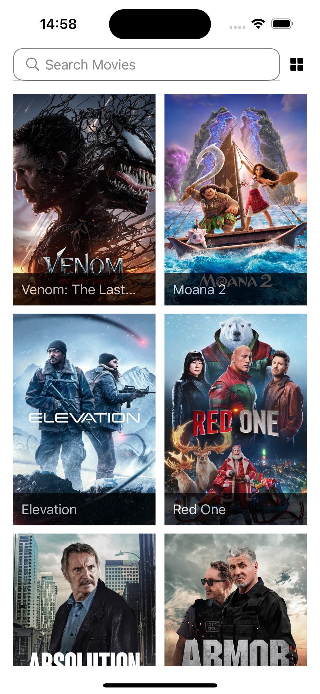
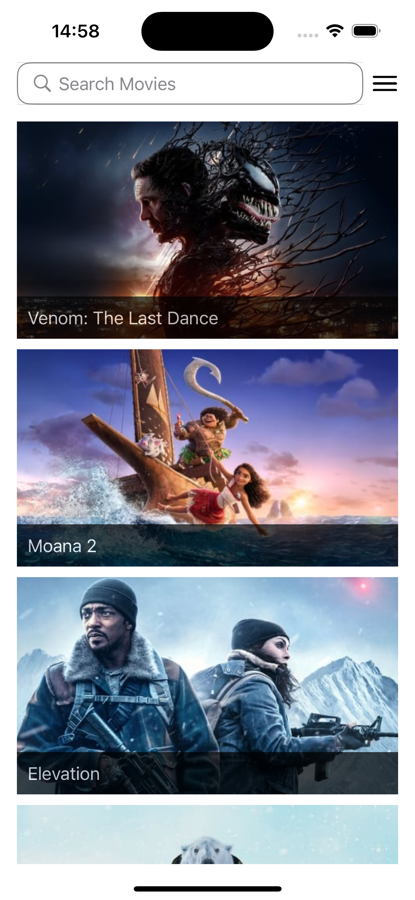
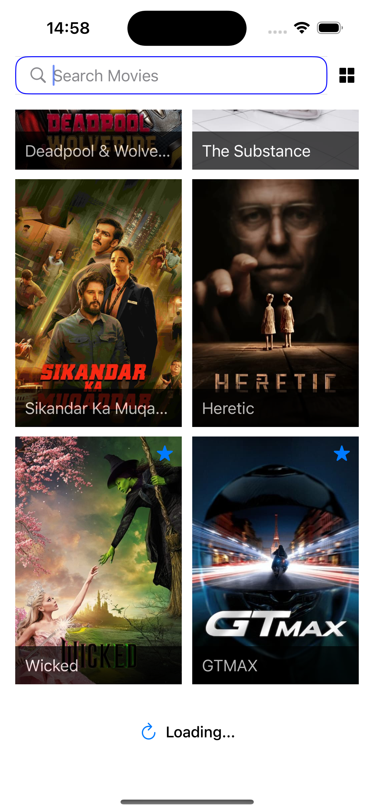
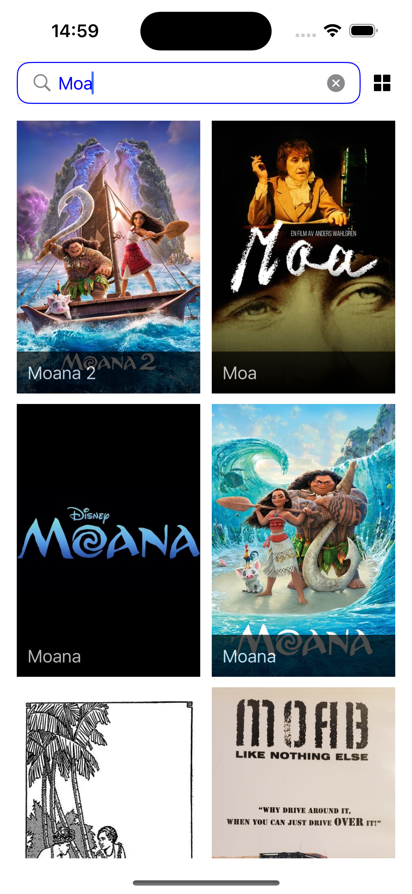
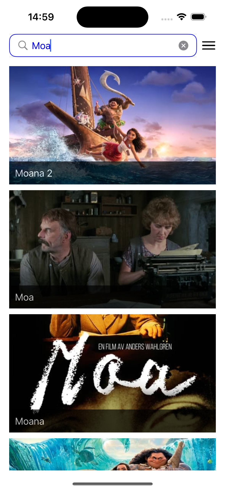

# MovieApp - Swift

MovieApp, popüler filmleri keşfetmek ve aramak için tasarlanmış bir iOS uygulamasıdır. Kullanıcılar, uygulama aracılığıyla film detaylarını görüntüleyebilir ve favori filmlerini seçebilir.

## **Özellikler**
- **Popüler Filmler**: Güncel popüler filmleri listeleme.  
- **Film Arama**: Anahtar kelimelere göre film arama.  
- **Film Detayları**: Seçilen filmin detay bilgilerini görüntüleme.  
- **Favori Filmler**: Filmleri favorilere ekleme veya çıkarma.  
- **Pagination Desteği**: Büyük veri listeleri için sonsuz kaydırma desteği.  
- **Çoklu Gösterim Modu**: Filmleri toplu ya da tekli olarak listeleme modu.

## **Ekran Görüntüleri**

